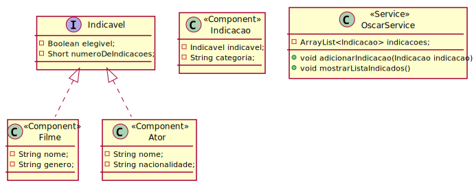
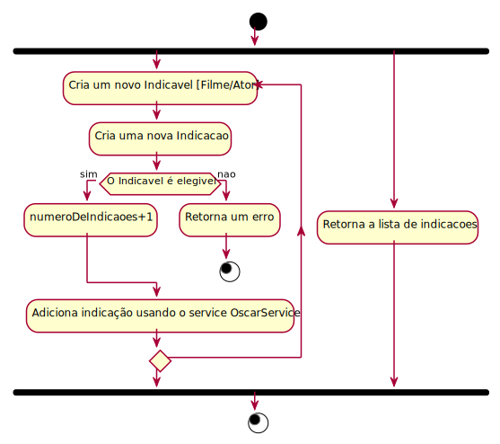

## Exercício C
Crie um novo projeto usando o Spring Framework que implemente um **service** chamada `OscarService` que seja responsável por adicionar filmes e atores à uma lista de indicados (array do tipo `Indicacao`). O service também deverá retornar a lista com todos os indicados e suas categorias;

Um ator ou filme não poderá ser indicado um atributo `elegivel` for falso. Para cada nova indicação, um atributo `numeroDeIndicacoes` deve ser incrementado. Ambos os atributos devem ser implementados por meio de uma interface chamada `Indicavel`.

---

---

---

Todos os atributos devem ter sua visibilidade `private`. Crie getters e setters para os atributos que necessitem de acesso/modificação.

O projeto deverá seguir a estrutura dos diagramas UML, porém alterações que incluam funcionalidades ou alterem o nome das classes são permitidas desde que mantenham o formato da implementação.

O projeto deverá conter pelo menos:

* 1x Service
* 1x Interface
* 3x Components

> BONUS: Implemente também a persistência da lista de indicados em um arquivo de texto;